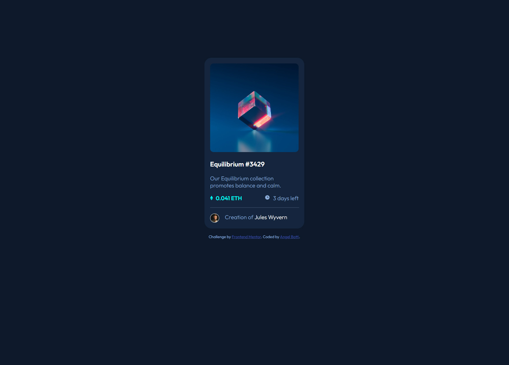
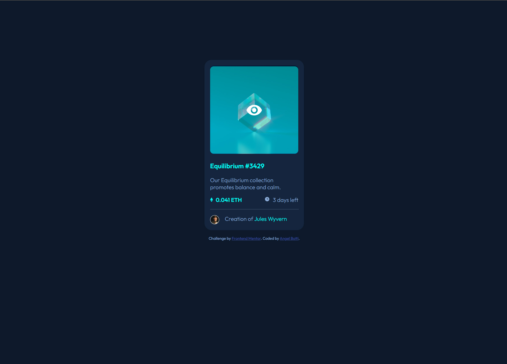
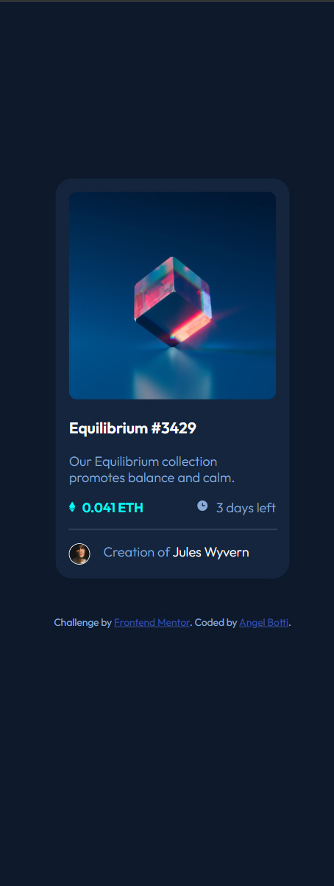

# Frontend Mentor - NFT preview card component solution

This is a solution to the [NFT preview card component challenge on Frontend Mentor](https://www.frontendmentor.io/challenges/nft-preview-card-component-SbdUL_w0U). Frontend Mentor challenges help you improve your coding skills by building realistic projects.

## Table of contents

- [Overview](#overview)
  - [The challenge](#the-challenge)
  - [Screenshot](#screenshot)
  - [Links](#links)
  - [Author](#author)

**Note: Delete this note and update the table of contents based on what sections you keep.**

## Overview

### The challenge

Users should be able to:

- View the optimal layout depending on their device's screen size
- See hover states for interactive elements

### Screenshot

Desktop view

Hover status

Mobile view

### Links

- Solution URL: [https://github.com/Botti13/NFT-preview-card-component](https://github.com/Botti13/NFT-preview-card-component)
- Live Site URL: [https://botti13.github.io/NFT-preview-card-component/](https://botti13.github.io/NFT-preview-card-component/)

## Author

- GitHub - [Botti13](https://github.com/Botti13)
- Frontend Mentor - [@Botti13](https://www.frontendmentor.io/profile/Botti13)
- LinkedIn - [Angel Botti](https://www.linkedin.com/in/angelbotti/)
